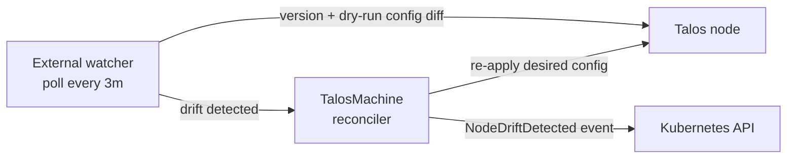

# Drift Detection

Talos Operator runs an external watcher that periodically checks whether the actual state of each Talos node still matches the desired state defined in the `TalosMachine` resource. If the node has drifted out-of-band, for example if someone edited the machine config directly with `talosctl apply-config` the operator detects it and re-applies the desired configuration automatically.

This complements the normal reconciliation flow: changes to the Custom Resources are picked up immediately through Kubernetes events, while the watcher covers changes that happen *on the node itself* and are therefore invisible to the Kubernetes API.

## How it works

For every `TalosMachine` that is in the `Available` state, the watcher runs a background poll loop (every **3 minutes** by default) that:

1. Connects to the machine's Talos endpoint (`spec.endpoint`).
2. Reads the node's reported Talos version and compares it against `spec.version`.
3. Builds the desired machine config for the machine and performs a **dry-run apply** against the node. The node responds with the diff between its running config and the desired config, without changing anything.

If the version differs or the node reports a non-empty config diff, the machine is considered **drifted**:

- The watcher records the drift and enqueues a reconciliation for the `TalosMachine`.
- The controller sees that the node diverged (even though `spec` and `status` still match) and re-applies the desired config to bring the node back in line.
- A `NodeDriftDetected` warning event is emitted on the `TalosMachine` object carrying the diff reported by the node (truncated if large; the full diff is available in the controller logs).

When a later poll observes the node back in sync, the drift entry is cleared and no further reconciles are triggered — a healthy, unchanged machine causes no reconciliation at all.



## What counts as drift

| Check | Desired | Actual | Drift when |
|---|---|---|---|
| Talos version | `spec.version` | Version reported by the node | Values differ |
| Machine config | Config rendered from the CRs (including config patches and `configRef`) | Running config on the node | Node reports a non-empty dry-run diff |

## Which machines are watched

Machines are registered with the watcher automatically; there is nothing to configure. A machine is only polled when:

- its `status.state` is `Available` (machines that are still booting, installing, or being deleted are skipped), and
- `spec.endpoint` is set.

Machines that are not ready yet are retried until they become watchable. Spec changes to a `TalosMachine` re-register it with the watcher; status-only updates are ignored.

## Observing drift

To see whether a machine has drifted and what the operator did about it:

```bash
kubectl describe talosmachine <name>
```

Look for `NodeDriftDetected` events. The controller logs also contain a `TalosMachine drift detected` entry with the desired/observed versions and the config diff.

The watcher additionally exposes Prometheus metrics on the operator's metrics endpoint:

| Metric | Description |
|---|---|
| `kube_external_watcher_poll_total` | Total number of polls per resource type |
| `kube_external_watcher_drift_detected_total` | Total number of drift detections |
| `kube_external_watcher_fetch_external_duration_seconds` | Latency of polling the Talos node |
| `kube_external_watcher_fetch_external_errors_total` | Errors while polling the Talos node |
| `kube_external_watcher_registered_resources` | Number of machines currently being watched |

## Notes

- The dry-run diff check is read-only: nothing is applied to the node during a poll. Configuration is only (re-)applied by the reconciler after drift has been detected.
- Drift detection uses the same config-rendering path as reconciliation, so config patches and `configRef` ConfigMaps are taken into account when computing the diff.
- The design background is documented in the [event-driven reconciliation proposal](https://github.com/alperencelik/talos-operator/blob/main/docs/proposals/0001-event-driven-reconciliation.md).
