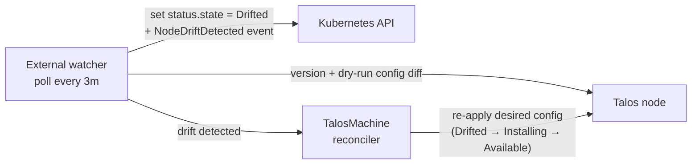

# Drift Detection

Talos Operator runs an external watcher that periodically checks whether the actual state of each Talos node still matches the desired state defined in the `TalosMachine` resource. If the node has drifted out-of-band, for example if someone edited the machine config directly with `talosctl apply-config` the operator detects it and re-applies the desired configuration automatically.

This complements the normal reconciliation flow: changes to the Custom Resources are picked up immediately through Kubernetes events, while the watcher covers changes that happen *on the node itself* and are therefore invisible to the Kubernetes API.

## How it works

For every `TalosMachine` that is in the `Available` state, the watcher runs a background poll loop (every **3 minutes** by default) that:

1. Connects to the machine's Talos endpoint (`spec.endpoint`).
2. Reads the node's reported Talos version and compares it against `spec.version`.
3. Builds the desired machine config for the machine and performs a **dry-run apply** against the node. The node responds with the diff between its running config and the desired config, without changing anything.

If the version differs or the node reports a non-empty config diff, the machine is considered **drifted** and the drift becomes part of the machine's state machine:

- The watcher sets the machine's `status.state` to **`Drifted`**, emits a `NodeDriftDetected` warning event carrying the diff reported by the node (truncated if large; the full diff is available in the operator logs), and enqueues a reconciliation.
- The controller sees the `Drifted` state (even though `spec` and `status` otherwise still match) and re-applies the desired config, moving the machine to `Installing` — or triggers an upgrade (`Upgrading`) when the node's Talos version diverged.
- Once the kubelet reports running, the machine settles back into `Available`: the full loop is `Available → Drifted → Installing → Available`.

Applying is what consumes the drift signal — the state transition to `Installing`/`Upgrading` clears `Drifted`, so a handled drift is not re-applied twice. If the node is still diverged at the next poll (something on the node keeps rewriting the config), it is simply marked `Drifted` again. A healthy, unchanged machine causes no state change and no reconciliation at all.



Only the `Available → Drifted` transition is ever written by the watcher: a machine that is already `Installing` or `Upgrading` is being converged by the reconciler, and a poll that started before that apply cannot overwrite it.

## What counts as drift

| Check | Desired | Actual | Drift when |
|---|---|---|---|
| Talos version | `spec.version` | Version reported by the node | Values differ |
| Machine config | Config rendered from the CRs (including config patches and `configRef`) | Running config on the node | Node reports a non-empty dry-run diff |

## Which machines are watched

Machines are registered with the watcher automatically; there is nothing to configure. A machine is only polled when:

- its `status.state` is `Available` or `Drifted` (machines that are still booting, installing, or being deleted are skipped), and
- `spec.endpoint` is set.

Machines annotated with the `DryRun` or `Disable` [reconciliation mode](reconciliation_modes.md) are never marked `Drifted` — the operator does not persist status for them.

Machines that are not ready yet are retried until they become watchable. Spec changes to a `TalosMachine` re-register it with the watcher; status-only updates are ignored.

## Observing drift

A drifted machine is directly visible in the state column:

```bash
kubectl get talosmachine
NAME        STATE     VERSION   ENDPOINT
machine-a   Drifted   v1.9.0    10.1.1.10
```

For the details, look for `NodeDriftDetected` events in `kubectl describe talosmachine <name>`. The operator logs also contain a `TalosMachine drift detected` entry with the desired/observed versions and the config diff.

The watcher additionally exposes Prometheus metrics on the operator's metrics endpoint:

| Metric | Description |
|---|---|
| `kube_external_watcher_poll_total` | Total number of polls per resource type |
| `kube_external_watcher_drift_detected_total` | Total number of drift detections |
| `kube_external_watcher_fetch_external_duration_seconds` | Latency of polling the Talos node |
| `kube_external_watcher_fetch_external_errors_total` | Errors while polling the Talos node |
| `kube_external_watcher_registered_resources` | Number of machines currently being watched |

## Notes

- The dry-run diff check is read-only: nothing is applied to the node during a poll. Configuration is only (re-)applied by the reconciler after drift has been detected.
- Drift detection uses the same config-rendering path as reconciliation, so config patches and `configRef` ConfigMaps are taken into account when computing the diff.
- The design background is documented in the [event-driven reconciliation proposal](https://github.com/alperencelik/talos-operator/blob/main/docs/proposals/0001-event-driven-reconciliation.md).
